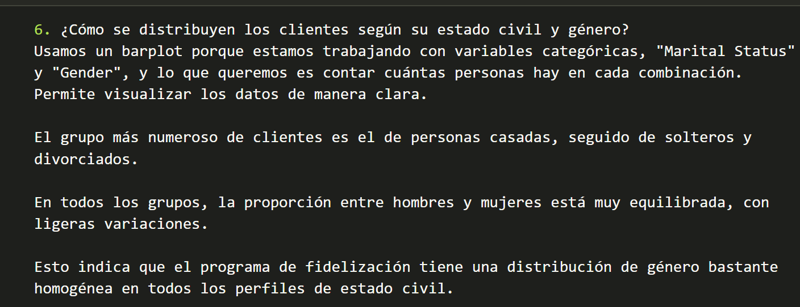
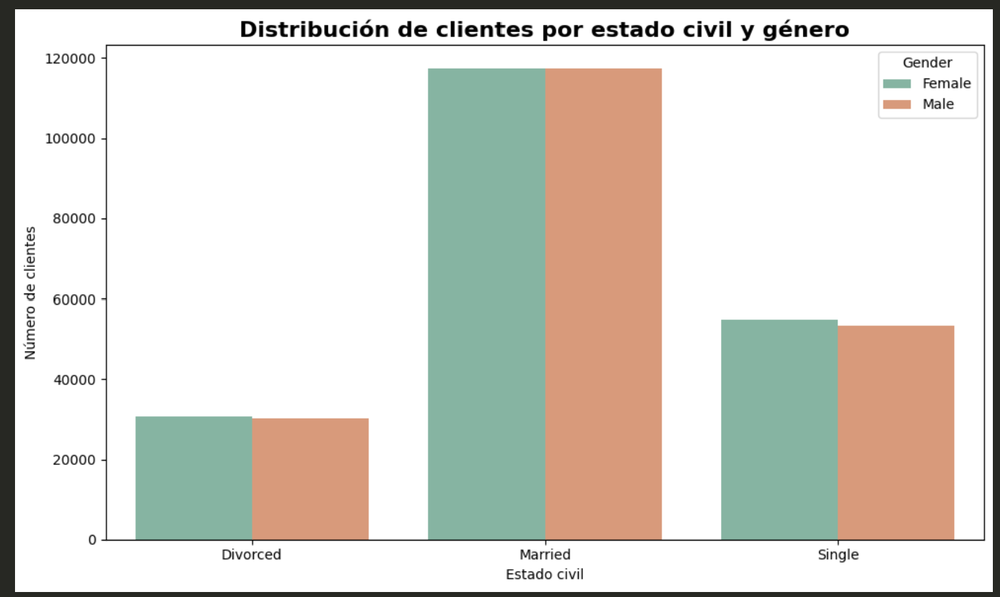

📊 DA Módulo 3 – Evaluación Final
Alumna: Romina Altamura González

Análisis y visualización de datos de un programa de lealtad de aerolínea.

📁 Descripción del proyecto

Este repositorio contiene la solución al ejercicio final del Módulo 3, donde se trabajó con dos datasets:

Customer Flight Analysis.csv – Actividad mensual de vuelo de cada cliente.

Customer Loyalty History.csv – Información demográfica y detalles de membresía del cliente.

El objetivo es realizar:

Exploración inicial

Limpieza y unión de datasets

Detección y manejo de duplicados

Análisis descriptivo

Visualizaciones con Matplotlib y Seaborn

🧹 Limpieza de datos

Se analizaron nulos, formatos incorrectos y valores imposibles.
Además, se aplicó una regla clave del dataset:

⚠️ Cada combinación única Loyalty Number + Year + Month debe existir solo una vez.
Si aparecen duplicados, son considerados errores del dataset.

Una vez analizado, se procedio a la limpieza y se creó una versión limpia del dataset la cual se nombró como Loyalty_Program_limpio.csv y que encontrarán dentro de este repositorio.

📈 Visualizaciones incluidas

En el archivo final visualizacion.ipynb se responden las preguntas solicitadas mediante gráficos:

Distribución de vuelos reservados por mes

Relación entre distancia y puntos acumulados

Distribución de clientes por provincia/estado

Salario promedio según nivel educativo

Proporción de tipos de tarjetas de fidelidad

Distribución por estado civil y género

✔️ Contenidos evaluados

Exploración de datos

Limpieza y gestión de nulos

Detección y manejo de duplicados

Estadística descriptiva

Visualización con Matplotlib y Seaborn

Buenas prácticas y organización del repositorio